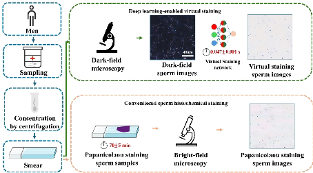

README: Non-Destructive and Real-time Virtual Staining of Spermatozoa via Dark-Field Microscopy

Project Overview

This repository contains the implementation of a lightweight Generative Adversarial Network (GAN) for real-time virtual staining of spermatozoa from dark-field microscopy images. The model converts label-free semen smears into high-contrast Papanicolaou-equivalent stained images in ~0.047 seconds for 2048×2048 images, achieving:

• Mean Squared Error (MSE): 0.0044 ± 0.0031

• Structural Similarity (SSIM): 0.905 ± 0.015

• Peak Signal-to-Noise Ratio (PSNR): 30.4247

The system bypasses traditional histological staining procedures, enabling non-destructive analysis of motile spermatozoa for assisted reproductive technology (ART).

Directory Structure

├── attention/              # Attention mechanisms for enhanced feature learning

├── data/                   # Sample datasets (train/val/test structure)

│   ├── train/              # Training images (dark-field ↔ Papanicolaou pairs)

│   └── val/                # Validation images

├── G\_network/              # Generator architectures

│   ├── SPPF\_UNet.py        # Core generator (SPPF777\_DSUNet)

│   ├── U2Net.py            # Comparison models

│   └── ...                 # Other generator variants

├── tools/             # Utility scripts and tools

│   ├── StyleLoss.py        # Style loss implementation

│   └── ...                 # Additional helper functions

├── D\_network.py            # Discriminator implementation (PatchGAN)

├── dataset.py              # Data loading and preprocessing

├── train.py                # Main training script

├── val\_netnumber.py        # Network parameter counting

├── val\_speed.py            # Inference speed benchmarking

├── val\_value.py            # Image quality evaluation (MSE/PSNR/SSIM)

└── README.md               # This document

File Directory Details

Core Components

1\. Generator Network (G\_network/SPPF\_UNet.py)

&nbsp;  • SPPF777\_DSUNet: Lightweight generator with:

&nbsp;    ◦ Spatial Pyramid Pooling Fusion (SPPF) blocks in downsampling

&nbsp;    ◦ Depthwise Separable Convolution (DSConv) in upsampling

&nbsp;    ◦ Only 0.831M parameters (15× smaller than U2-Net)

2\. Discriminator (D\_network.py)

&nbsp;  • PatchGAN architecture with 5 convolutional layers

&nbsp;  • Outputs 16×16 probability matrix

3\. Data Pipeline (dataset.py)

&nbsp;  • Image registration and alignment

&nbsp;  • 256×256 patch extraction

&nbsp;  • Normalization and augmentation

Training \& Evaluation

• Training (train.py):

&nbsp; • Combined loss: MSE + L1 (λ=100)

&nbsp; • Adam optimizer (lr=0.0002, β1=0.5, β2=0.999)

&nbsp; • Checkpoint saving (best weights by pixel loss)

&nbsp; 

• Evaluation Scripts:

&nbsp; • Network params: val\_netnumber.py

&nbsp; • Inference speed: val\_speed.py

&nbsp; • Image quality: val\_value.py

Utility Modules

• Attention Mechanisms (attention/)

&nbsp; • Various attention blocks for feature refinement

• Style Loss (localutils/StyleLoss.py)

&nbsp; • Gram matrix-based style preservation

Quick Start Guide

1\. Installation

git clone https://github.com/swaggyer/sperm-virtual-staining.git

cd sperm-virtual-staining

pip install -r requirements.txt  # Install dependencies

2\. Data Preparation

1\. Place paired datasets in data/train/ and data/val/

2\. Format: 

&nbsp;  • Dark-field images: \*\_A.tif

&nbsp;  • Papanicolaou-stained images: \*\_B.tif

3\. Training

python train.py \\

&nbsp; --dataset\_name SPPF\_DS \\

&nbsp; --data\_root data \\

&nbsp; --batch\_size 2 \\

&nbsp; --n\_epochs 200

4\. Inference \& Evaluation

Virtual Staining:

python val\_speed.py \\

&nbsp; --generator\_path saved\_models/SPPF\_DS/best\_generator.pth \\

&nbsp; --input\_folder data/test/darkfield/ \\

&nbsp; --output\_folder results/virtual\_staining/

Quality Evaluation:

python val\_value.py \\

&nbsp; --real\_dir data/test/papanicolaou/ \\

&nbsp; --fake\_dir results/virtual\_staining/ \\

&nbsp; --output\_dir evaluation\_results/

Key Features

• 🚀 Real-time Processing: 21 FPS for 2048×2048 images

• 🧠 Lightweight Architecture: 0.831M parameters

• 🧪 Non-Destructive Analysis: Preserves sperm motility

• 📊 Quantitative Validation: MSE/PSNR/SSIM metrics

Contact

For technical inquiries or dataset access:

• Jiahao Wang: jiahaow77@163.com  

• Corresponding Authors:

&nbsp; • Siqi Zhu: tzhusiqi@jnu.edu.cn

&nbsp; • LiJun Wei: ljwei.opt@gmail.com

\*This work was supported by:  

Key Technologies R\&D Program of Guangzhou (202206010082)  

Fundamental Research Funds for Central Universities (21623102)  

Medical Scientific Research Foundation of Guangdong Province (B2023416, B2023135)\*

